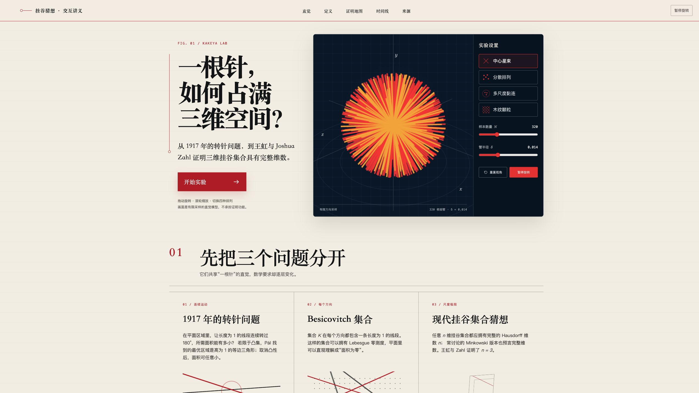

# 挂谷猜想交互实验室

用 Three.js 与 HTML Canvas 讲解挂谷猜想、三维挂谷集合，以及王虹与 Joshua Zahl 证明三维挂谷猜想的公开结论

在线体验：[kakeya-conjecture-lab.pages.dev](https://kakeya-conjecture-lab.pages.dev/)



## 页面包含什么

- 可旋转、缩放并调节样本数量与管半径的三维细管实验
- 中心星束、分散排列、多尺度黏连、木纹颗粒四种排列
- 两块用于观察线段重叠与 δ 邻域的二维画布
- 挂谷集合定义、Hausdorff 与 Minkowski 维数说明
- 王虹与 Joshua Zahl 证明思路的五站式地图
- 时间线、已知边界与可追溯资料来源

页面中的有限线段与细管只用于建立直觉，不能代替数学证明

## 本地运行

需要 Node.js 20 或更高版本

```bash
npm install
npm run dev
```

浏览器打开终端给出的地址即可

## 生成发布版本

```bash
npm run build
```

生成结果位于 `dist/index.html`，已打包为单个 HTML 文件

## 发布到 Cloudflare Pages

登录 Wrangler 后执行

```bash
npm run deploy
```

## 资料来源

- [国际数学联盟：2026 年菲尔兹奖](https://www.mathunion.org/imu-awards/fields-medal/fields-medals-2026)
- [王虹官方获奖词](https://www.mathunion.org/fileadmin/documents/2026-07/Hong_Wang_Citations.pdf)
- [Wang–Zahl：三维挂谷猜想论文](https://arxiv.org/abs/2502.17655)
- [Guth–Wang–Zahl：精简证明](https://arxiv.org/abs/2601.14411)
- [Larry Guth：三维挂谷猜想综述](https://arxiv.org/abs/2604.03416)
- [Terence Tao：三维挂谷猜想讲解](https://terrytao.wordpress.com/2025/02/25/the-three-dimensional-kakeya-conjecture-after-wang-and-zahl/)

## 可复用方向

这套“资料核验、直觉模型、正式定义、互动实验、边界说明、来源追溯”的讲解方式也适合日食、月食、太阳系、四季、潮汐、轨道等科学主题

它可以帮助孩子通过操作理解科学知识，也可以帮助成年人更快建立对陌生问题的整体认识

